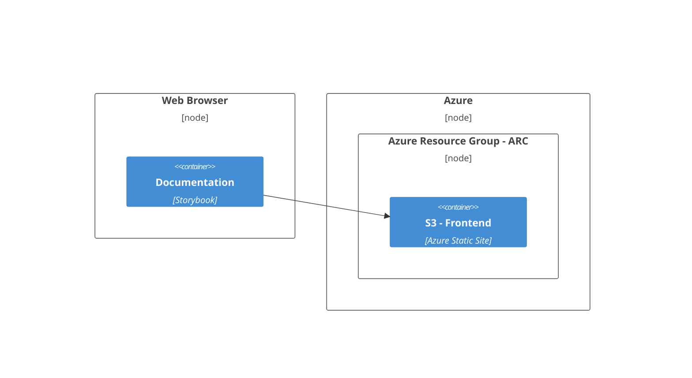

# Contributing

> This document outlines the guidelines and best practices to get started contributing to **ARC**.

We welcome all contributions and engagement with the **ARC** design system.

**ARC** is built using [LIT](https://lit.dev/) web components and is built on top of the Web Components standards. Every component is a native web component, with the power of interoperability. Web components work anywhere you use HTML, with any framework, or none at all. This makes using **ARC** ideal for building shareable components, or maintainable, future-ready sites and apps.

- [Development Environment](#development-environment)
- [Dependencies](#dependencies)
- [Workspace](#workspace)
- [Build System](#build-system)
- [Development Guidelines](#development-guidelines)
  - [Directory Structure](#directory-structure)
  - [Local Development Server](#local-development-server)
  - [Unit Tests](#unit-tests)
  - [Documentation](#documentation)
  - [Formatting and Linting](#formatting-and-linting)
- [Infrastructure](#infrastructure)
- [Guides](#guides)

## Development Environment

The following system native build dependencies are required for a local development environment:

- [git](https://git-scm.com/)
- [Node.js](https://nodejs.org/en/)
- [Terraform](https://www.terraform.io/)
- [Azure CLI](https://learn.microsoft.com/en-us/cli/azure/)

<details>
  <summary>NIX</summary>

If you are using [NIX](https://nixos.org/) switch to the the provided development shell with:

```sh
nix develop
```

</details>

## Dependencies

Install all package dependencies using npm:

```sh
npm ci && npx playwright install --with-deps
```

<details>
  <summary>NIX</summary>

If you are using [NIX](https://nixos.org/) use the `[clean-install](https://github.com/arup-group/arc-components/blob/main/flake.nix#L19-L31)` deerivation:

```sh
clean-install
```

</details>

## Workspace

This worksapce is a monorepo containing all packages and playgrounds that relate to the **ARC** design system. The following directory structure is used:

```
├── assets              # Shared assets for storybook and playgrounds
├── infrastructure      # Infrastructure managed by Terraform
├── packages
│   ├── components      # @arc-web/components package source
│   └── react           # @arc-web/react package source
└── playgrounds
    ├── angular         # Angular + ARC playground
    ├── javascript      # Vanilla Javascript + ARC playground
    ├── node-ssr        # NodeJs SSR + ARC playground
    ├── react           # React + ARC playground
    └── vue             # Vue + ARC playground
```

## Build System

[NX](https://nx.dev/) is used as a build system and tasks are run using its [run tasks](https://nx.dev/core-features/run-tasks) core functionality:

```sh
npx nx run <project>:<target>:<configuration>
```

## Development Guidelines

All development contributions should adhere to the following guidelines:

### Directory Structure

The following directory structure should be followed when creating simple components:

```
└── packages
    └── components
        └─── src
           └── components
               └── foo
                   ├── ArcFoo.ts              # Component class implmentation
                   ├── arc-foo.stories.ts     # Storybook stories for component
                   ├── arc-foo.styles.ts      # Styles for component
                   ├── arc-foo.test.ts        # Tests for component
                   └── arc-foo.ts             # Component element registation
```

More complex compnents may also adher to the following:

```
└── packages
    └── components
        └─── src
           └── components
               └── foo
                   ├── constants
                   │   ├── FooConstants.test.ts    # Tests for constants
                   │   └── FooConstants.ts         # Constants for component
                   ├── ArcFoo.ts                   # Component class implmentation
                   ├── arc-foo.documentation.mdx   # Storybook documentation for component
                   ├── arc-foo.stories.tsx         # Storybook stories for component
                   ├── arc-foo.styles.ts           # Styles for component
                   ├── arc-foo.test.ts             # Tests for component
                   └── arc-foo.ts                  # Component element registration
```

### Local Development Server

During development use the following command to start a local development server in any of the playgrounds:

```sh
npx nx run <angular-playground | lit-playground | react-playground | vue-playground | vanilla-playground | node-playground>:serve
```

Or start the storybook development server with:

```sh
npx nx run components:storybook:serve
```

Source code chanages will be hot reloaded in the browser making any of the above commands ideal for local component development.

### Unit Tests

Unit tests must be written for all components and can be run using the following command:

```sh
npx nx run-many --target test
```

### Documentation

Every component requires the following documentation:

- Docstrings for all public methods and properties
- Storybook stories for all use cases
- Storybook documentation (auto-generated from stories for simple components)

### Formatting and Linting

Workspace files must adhere to the formatting and linting rules. You can run the formatter with the command:

```sh
npx nx format
```

And the linter for all projects with:

```sh
npx nx run-many --target lint
```

### Commit Messages, Branches and Pull Requests

Commit messages must adhere to the [Conventional Commits](https://www.conventionalcommits.org/en/v1.0.0/) specification and branches much follow the [Gitflow](https://www.atlassian.com/git/tutorials/comparing-workflows/gitflow-workflow) branching model.

Pull requests will be squash merged by default the core maintainers, once accepted and approved, please ensure your PR title and description follow the [Conventional Commits](https://www.conventionalcommits.org/en/v1.0.0/) specification to ensure the correct changelog is generated. More complex PR's may be merged using the merge commit strategy.

Link any commits, issues and pull requests to the relevant Jira ticket, if applicable.

### Infrastructure

The **ARC** project infrastucture is spread across the following deployment nodes:



## Guides

### Icons

**ARC** uses [Phosphor Icons](https://phosphoricons.com/) as for its icon set. When updating the `@phosphor-icons/core` dependency ensure to run the `npx nx run components:ph-icons-assemble` target that updates the the genorated web components.

### Release

Use the `arc-release` script to set a new version for all packages within the workspace with:

```sh
npx nx run arc-release
```

Packages and storybook documentation for the release are built and published using the [publish](./.github/workflows/publish.yml) workflow upon a GitHub release being created.

### Updating Infrastucture

To update infrastructure:

1. Make changes to the [infrastructure](./infrastructure) terraform files.
2. Run `npx nx run infrastructure:plan` to see the changes that will be applied.
3. Submit a pull request with the changes. Include the output of `npx nx run infrastructure:plan` in the pull request description.
4. Once the pull request is approved and merged into main run the `npx nx run infrastructure:apply` to apply chanages.
