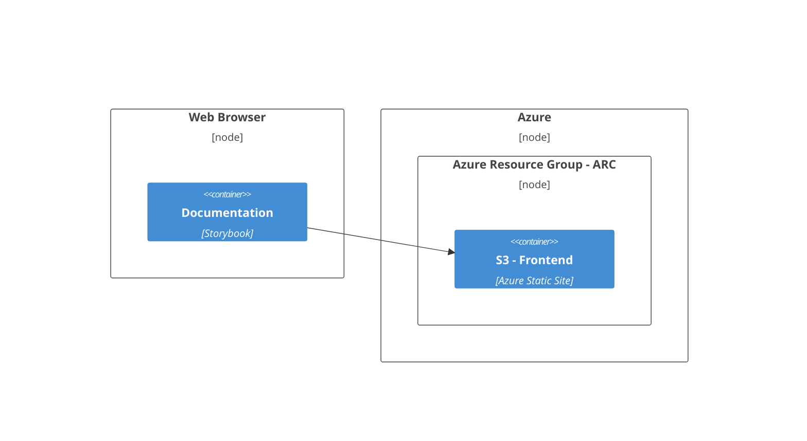

# Contributing

> This document outlines the guidelines and best practices to get started contributing to **ARC**.

We welcome all contributions and engagement with the **ARC** design system.

**ARC** is built using [LIT](https://lit.dev/) web components and is built on top of the Web Components standards. Every component is a native web component, with the power of interoperability. Web components work anywhere you use HTML, with any framework, or none at all. This makes using **ARC** ideal for building shareable components, or maintainable, future-ready sites and apps.

- [Workspace](#workspace)
- [Development Environment](#development-environment)
- [Build System](#build-system)
- [Development Guidelines](#development-guidelines)
  - [Directory Structure](#directory-structure)
  - [Local Development Server](#local-development-server)
  - [Unit Tests](#unit-tests)
  - [Documentation](#documentation)
  - [Formatting and Linting](#formatting-and-linting)
- [Infrastructure](#infrastructure)
- [Guides](#guides)

## Workspace

This workspace is a monorepo containing all packages and playgrounds that relate to the **ARC** design system. The following directory structure is used:

```
├── assets              # Shared assets for storybook and playgrounds
├── infrastructure      # Infrastructure managed by Terraform
├── packages
│   ├── components      # @arc-web/components package source
│   └── react           # @arc-web/react package source
└── playgrounds
    ├── angular         # Angular + ARC playground
    ├── javascript      # Vanilla Javascript + ARC playground
    ├── node-ssr        # NodeJs SSR + ARC playground
    ├── react           # React + ARC playground
    └── vue             # Vue + ARC playground
```

[NX](https://nx.dev/) is used as a monorepo management for the Javascript ecosystem within this workspace.

## Development Environment

Switch to the provided develop environment using the following command:

```sh
nix develop
```

Install dependencies using the following command:

```sh
npm install --legacy-peer-deps
```

See relative project.json for each package or playground for available [NX](https://nx.dev/) runnable targets.

## Build System

**Nix** is used for all builds - please see our [flake](./flake.nix).

## Development Guidelines

All development contributions should adhere to the following guidelines:

### Directory Structure

The following directory structure should be followed when creating simple components:

```
└── packages
    └── components
        └─── src
           └── components
               └── foo
                   ├── ArcFoo.ts              # Component class implementation
                   ├── arc-foo.stories.ts     # Storybook stories for component
                   ├── arc-foo.styles.ts      # Styles for component
                   ├── arc-foo.test.ts        # Tests for component
                   └── arc-foo.ts             # Component element registration
```

More complex components may also adher to the following:

```
└── packages
    └── components
        └─── src
           └── components
               └── foo
                   ├── constants
                   │   ├── FooConstants.test.ts    # Tests for constants
                   │   └── FooConstants.ts         # Constants for component
                   ├── ArcFoo.ts                   # Component class implementation
                   ├── arc-foo.documentation.mdx   # Storybook documentation for component
                   ├── arc-foo.stories.tsx         # Storybook stories for component
                   ├── arc-foo.styles.ts           # Styles for component
                   ├── arc-foo.test.ts             # Tests for component
                   └── arc-foo.ts                  # Component element registration
```

### Local Development Server

During development use the following command to start a local development server in any of the playgrounds:

```sh
npx nx run <angular-playground | lit-playground | react-playground | vue-playground | vanilla-playground | node-playground>:serve
```

Or start the storybook development server with:

```sh
npx nx run documentation:serve
```

Source code changes will be hot reloaded in the browser making any of the above commands ideal for local component development.

### Unit Tests

Unit tests must be written for all components and can be run using the following command:

```sh
npx nx run-many --target test
```

### Documentation

Every component requires the following documentation:

- Docstrings for all public methods and properties
- Storybook stories for all use cases
- Storybook documentation (auto-generated from stories for simple components)

### Formatting and Linting

Format this workspace with:

```sh
npx nx format:write
```

Run all lint targets using:

```sh
npx nx run-many --target lint
```

### Commit Messages, Branches and Pull Requests

Commit messages must adhere to the [Conventional Commits](https://www.conventionalcommits.org/en/v1.0.0/) specification and branches much follow the [Gitflow](https://www.atlassian.com/git/tutorials/comparing-workflows/gitflow-workflow) branching model.

Pull requests will be squash merged by default the core maintainers, once accepted and approved, please ensure your PR title and description follow the [Conventional Commits](https://www.conventionalcommits.org/en/v1.0.0/) specification to ensure the correct changelog is generated. More complex PR's may be merged using the merge commit strategy.

Link any commits, issues and pull requests to the relevant Jira ticket, if applicable.

### Infrastructure

The **ARC** project infrastructure is spread across the following deployment nodes:



## Guides

### Release

1. Update all package.json versions and run `npm install --legacy-peer-deps`
2. Compute a new sha256 hash for the `buildArcPackage` function in lib.nix with `prefetch-npm-deps package-lock.json`
3. Create a release commit, tag and GitHub release
4. Checkout the release tag
5. For each package built it with Nix: `nix build .#<package-name>`
6. For each package the release to NPM: `cd result && npm publish`
